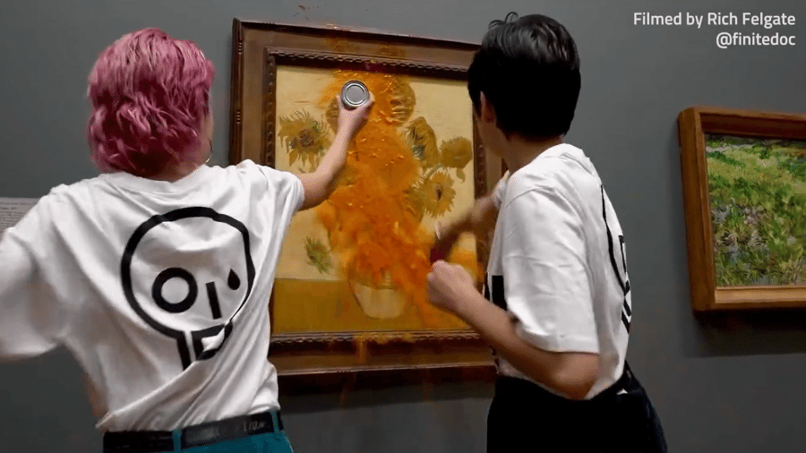

# Jornal do Carmela

# **Ativistas e o Quadro de Van Gogh**
---

Nesse última sexta-feira (14), Duas mulheres entraram em uma galeria em Loudres (National Gallery)  e jogarem dias latas de sopa de tomate em uma das obra da série "girassóis" de Vincent Van Gogh.

As duas ativitas do grupo Just Stop Oil, que tem protestado contra as mudanças climáticas na última quinzena na capital Britânica.

De acordo com a agência Reuters, a polícia local informou que "oficiais agiram rapidamente depois que ativista lançaram uma substância no quadro". "As duas manifestantes foram detidas por crime de dano."

Ao jogarem as latas na pintura, o grupo fez algumas postagens no Instagram em que questionavam se "a arte vale mais que a vida, mais do que comida, mais do que justiça".

Pouco depois a galeria se manifestou em suas redes sociais e informou que, além de lançar a sopa de tomate no quadro, a dupla colou as mãos na parede em que se encontra a obra, que é de 1888. Ainda de acordo com o comunicado, a instituição retirou os visitantes da sala e chamou a polícia.

"Há alguns pequenos danos no quadro, mas a pintura está ilesa. Duas pessoas foram presas", informou a galeria.

Julgamento por ação foi marcado para 13 de dezembro.

 

 

 

